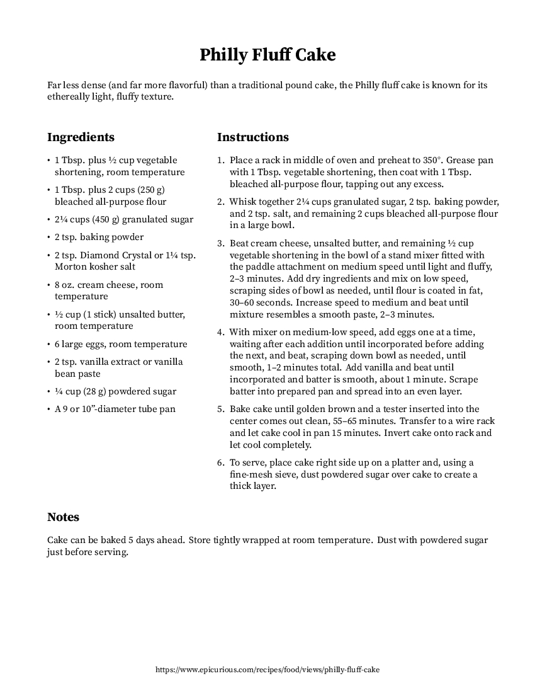
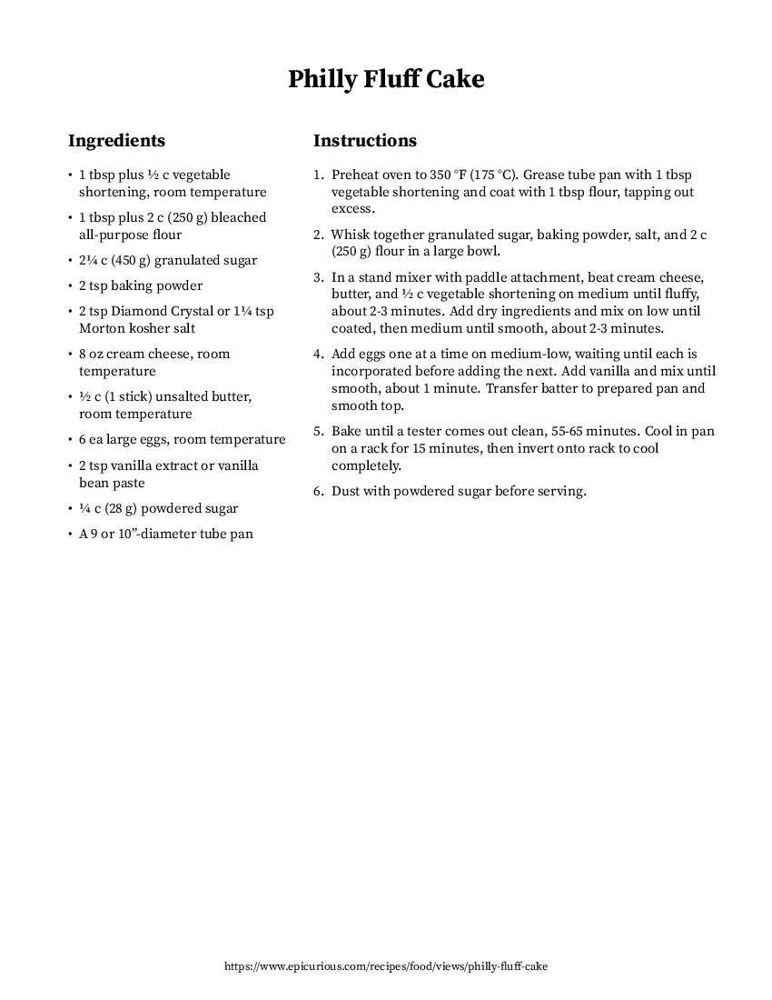

# Recipe Formatter

## Overview

Uses the OpenAI API to reformat a recipe from a URL or local file and converts it into JSON, markdown, LaTeX, or PDF format.

## Usage

```
rf [OPTIONS] URL_OR_FILE
```

### Options

#### `-o, --output OUTPUT`

Define the output file path for the formatted recipe.

If the file path contains the special token `{title}`, it will be replaced with the slugified recipe name.

If no output path is specified, the recipe will be printed to stdout.

#### `-f, --format FORMAT`

Supported formats: `json`, `md`, `tex`, and `pdf`.

If no format is specified, the output format will be inferred from the output file extension. If no output file is specified, or the specified output file has an extension that is not recognized, the recipe will be formatted as JSON and printed to stdout.

#### `-m, --model MODEL`

Specify the OpenAI model to use for recipe formatting. Defaults to `gpt-4-turbo`.

#### `-c, --clean`

Rewrite instructions to be more concise, clean up ingredients, and remove unnecessary information. Defaults to `false`.

#### `-v, --verbose`

Enable verbose mode to display additional information during processing. Defaults to `false`.

## Examples

### PDF

```
OPENAI_API_KEY='your-api-key'

rf -f pdf -o example.pdf https://www.epicurious.com/recipes/food/views/flourless-chocolate-cake-14478
rf -f pdf -o example-cleaned.pdf -c https://www.epicurious.com/recipes/food/views/flourless-chocolate-cake-14478
```

|     |   |
|:-----------------------------------:|:---------------------------------------------------:|
| [example.pdf](examples/example.pdf) | [example-cleaned.pdf](examples/example-cleaned.pdf) |

### Markdown

```
rf -f md -o example.md https://www.allrecipes.com/recipe/240784/easy-coleslaw-dressing
rf -f md -o example-cleaned.md -c https://www.allrecipes.com/recipe/240784/easy-coleslaw-dressing
```

#### Normal

```markdown
# Easy Coleslaw Dressing

For a coleslaw recipe that's creamy and delicious, toss this easy-to-make, 5-minute homemade dressing with a bag of store-bought coleslaw mix.

## Ingredients

* 0.5 cup mayonnaise
* 2 tablespoons white sugar
* 1.5 tablespoons lemon juice
* 1 tablespoon vinegar
* 0.5 teaspoon ground black pepper
* 0.25 teaspoon salt

## Instructions

1. Gather all ingredients.
2. Whisk mayonnaise, sugar, lemon juice, vinegar, pepper, and salt together in a bowl until smooth and creamy.
3. Store in an airtight container.

## Notes

This dressing can be used immediately or stored in the refrigerator for up to a week.

Source: https://www.allrecipes.com/recipe/240784/easy-coleslaw-dressing/
```

#### Cleaned

```markdown
# Easy Coleslaw Dressing

For a coleslaw recipe that's creamy and delicious, toss this easy-to-make, 5-minute homemade dressing with a bag of store-bought coleslaw mix.

## Ingredients

* 1⁄2 c mayonnaise
* 2 tbsp white sugar
* 1 1⁄2 tbsp lemon juice
* 1 tbsp vinegar
* 1⁄2 tsp ground black pepper
* 1⁄4 tsp salt

## Instructions

1. Whisk mayonnaise, sugar, lemon juice, vinegar, pepper, and salt together in a bowl until smooth.
2. Transfer to an airtight container for storage.

Source: https://www.allrecipes.com/recipe/240784/easy-coleslaw-dressing/
```

### JSON

```
rf -f json -o example.json https://www.allrecipes.com/recipe/16760/best-fried-green-tomatoes/
rf -f json -o example-cleaned.json -c https://www.allrecipes.com/recipe/16760/best-fried-green-tomatoes/
```

#### Normal

```json
{
    "title": "Best Fried Green Tomatoes",
    "description": "These fried green tomatoes are perfectly crispy outside, juicy inside, and a quick and easy way to use up green tomatoes for a wonderful late summer treat.",
    "ingredients": [
        "4 large green tomatoes",
        "2 eggs",
        "0.5 cup milk",
        "1 cup all-purpose flour",
        "0.5 cup cornmeal",
        "0.5 cup bread crumbs",
        "2 teaspoons coarse kosher salt",
        "0.25 teaspoon ground black pepper",
        "1 quart vegetable oil for frying"
    ],
    "instructions": [
        "Gather all ingredients.",
        "Slice tomatoes 1/2 inch thick. Discard the ends.",
        "Whisk eggs and milk together in a medium-sized bowl. Scoop flour onto a plate. Mix cornmeal, bread crumbs, salt, and pepper on another plate. Dip tomatoes into flour to coat. Then dip tomatoes into milk and egg mixture; dredge in breadcrumbs to completely coat.",
        "Heat oil in a large deep skillet to 375 degrees F (190 degrees C). Place tomatoes in hot oil in batches of 4 or 5, to prevent them from touching; fry until crisp and golden brown on one side, then flip and fry on other side.",
        "Transfer fried tomatoes to a paper towel-lined plate to drain. Repeat with remaining tomatoes.",
        "Serve hot and enjoy!"
    ],
    "notes": "For extra flavor, you can add a pinch of cayenne pepper to the breadcrumb mixture.",
    "source": "https://www.allrecipes.com/recipe/16760/best-fried-green-tomatoes/"
}
```

#### Cleaned

```json
{
    "title": "Fried Green Tomatoes",
    "ingredients": [
        "4 large green tomatoes",
        "2 ea eggs",
        "1⁄2 c milk",
        "1 c all-purpose flour",
        "1⁄2 c cornmeal",
        "1⁄2 c bread crumbs",
        "2 tsp coarse kosher salt",
        "1⁄4 tsp ground black pepper",
        "1 qt vegetable oil for frying"
    ],
    "instructions": [
        "Slice tomatoes 1⁄2 in thick. Discard the ends.",
        "Whisk eggs and milk together in a medium-sized bowl. Place flour on a plate. Combine cornmeal, bread crumbs, salt, and pepper on another plate.",
        "Dip tomatoes into flour to coat, then into the egg and milk mixture, and finally dredge in the breadcrumb mixture to completely coat.",
        "Heat oil in a large deep skillet to 375 °F (190 °C). Fry tomatoes in batches of 4 or 5, ensuring they do not touch, until crisp and golden brown on both sides.",
        "Transfer fried tomatoes to a paper towel-lined plate to drain. Repeat with remaining tomatoes."
    ],
    "source": "https://www.allrecipes.com/recipe/16760/best-fried-green-tomatoes/"
}
```

## Dependencies

### Python

Python 3.8+ should be fine. Creating a self-contained binary requires a Python compatible with Nuitka (tested with Python 3.11).

```
python3 -m venv .venv
source .venv/bin/activate
pip install -r requirements.txt
```

### Arch

```
sudo pacman -Sy texlive adobe-source-serif-fonts
```

## Installation

Build a self-contained executable (`rf`) using Nuitka and install to `~/.local/bin`:

```
make install
```
