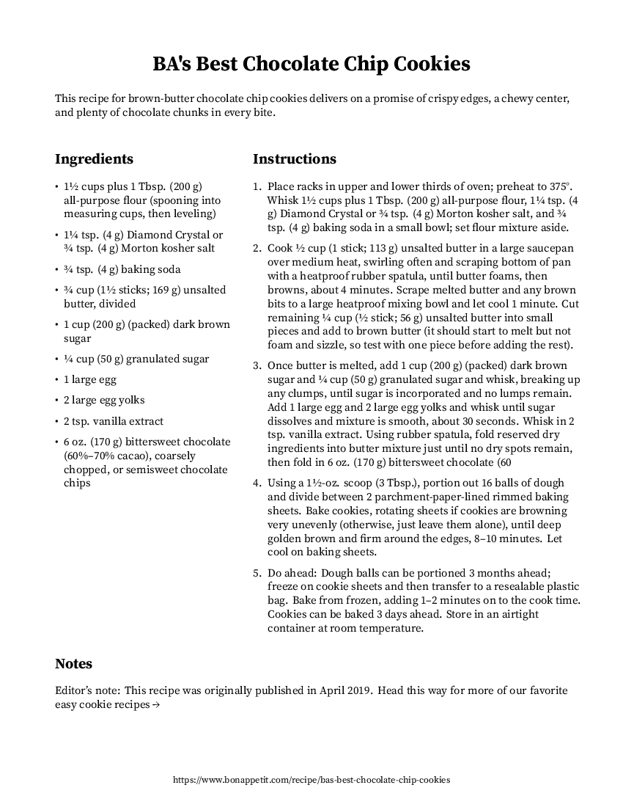
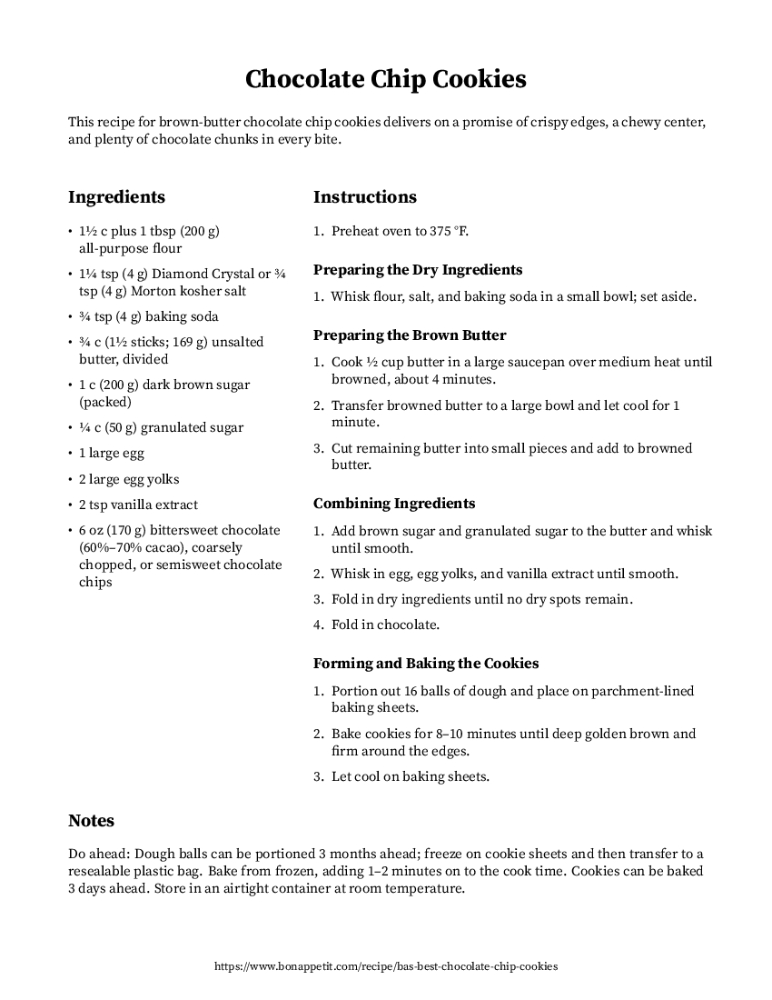
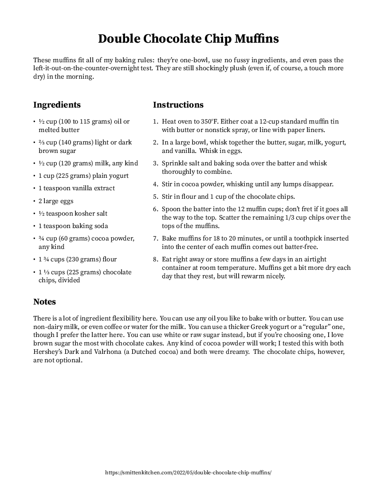
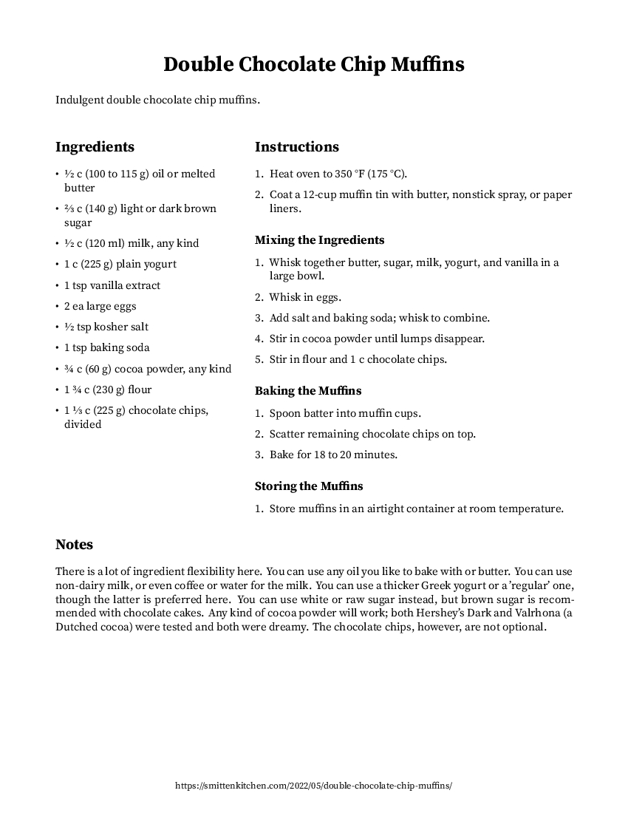
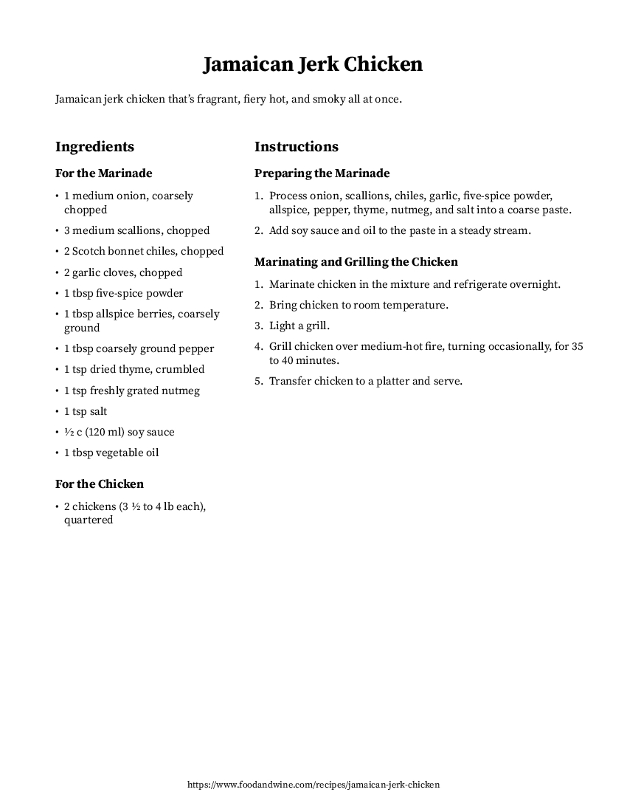
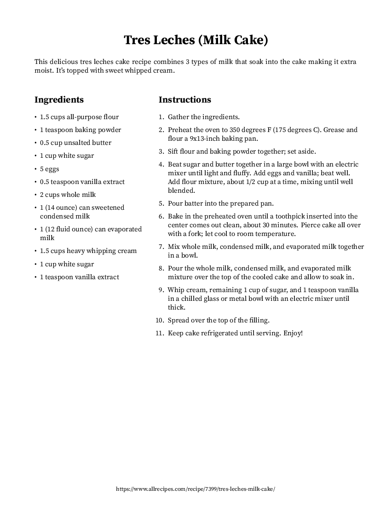
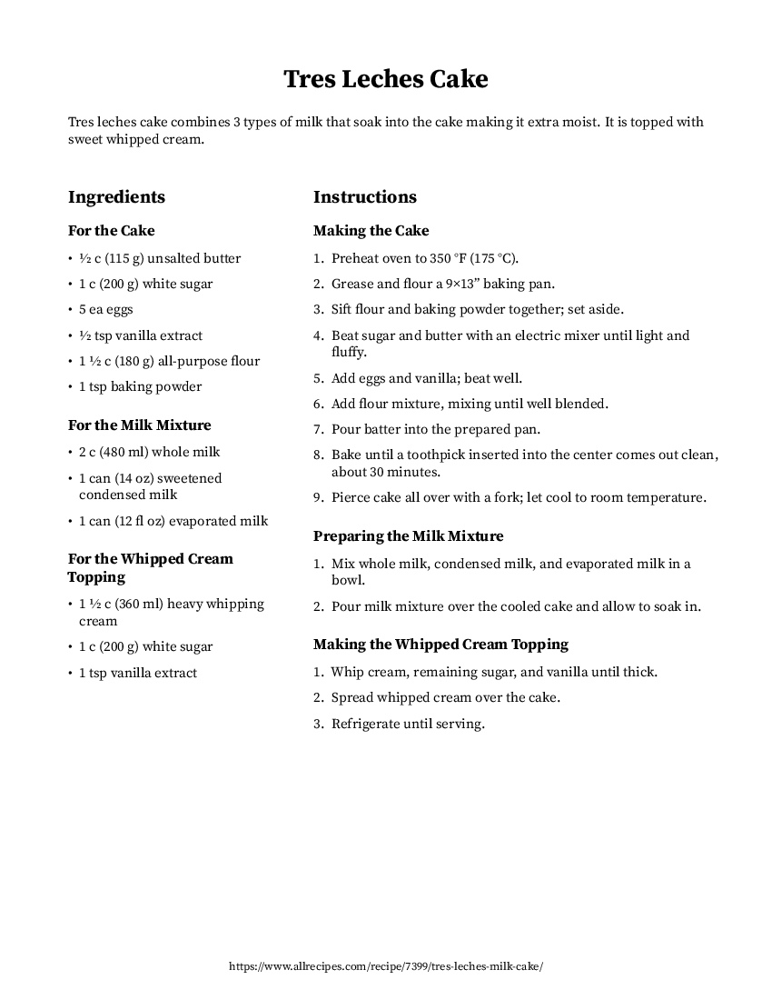
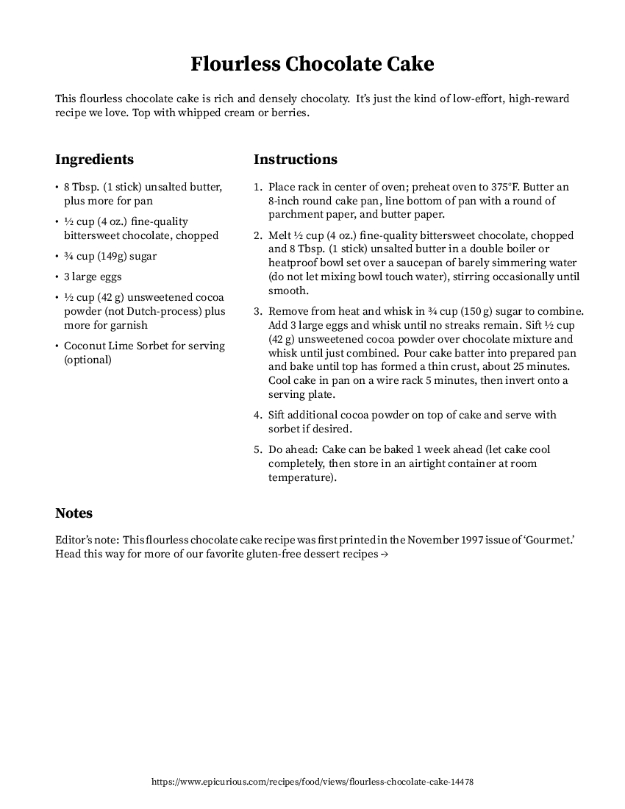
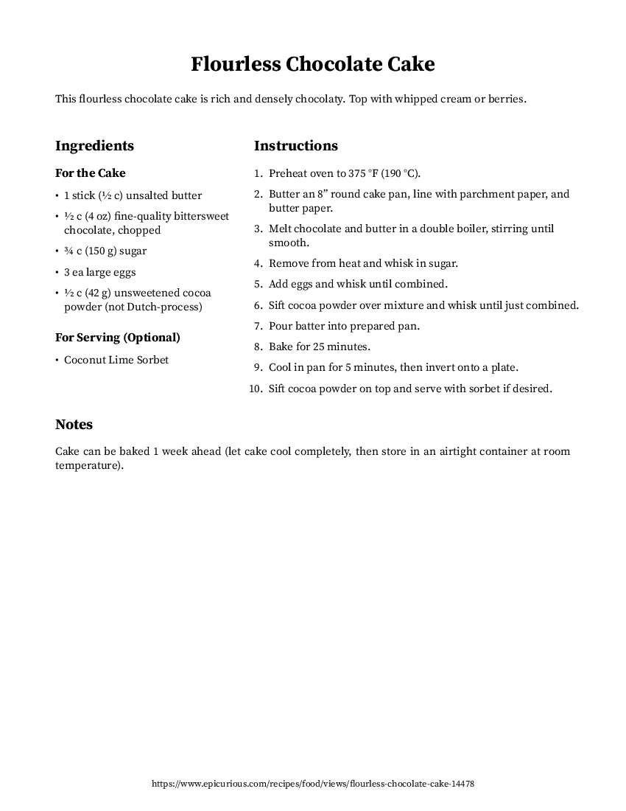

# Recipe Formatter

## Overview

Uses the OpenAI API to reformat a recipe from a URL or local file and converts it into JSON, markdown, LaTeX, or PDF format.

## Usage

```
rf [OPTIONS] URL_OR_FILE
```

### Options

#### `-o, --output OUTPUT`

Define the output file path for the formatted recipe.

If the file path contains the special token `{title}`, it will be replaced with the slugified recipe name.

If no output path is specified, the recipe will be printed to stdout.

#### `-f, --format FORMAT`

Supported formats: `json`, `md`, `tex`, and `pdf`.

If no format is specified, the output format will be inferred from the output file extension. If no output file is specified, or the specified output file has an extension that is not recognized, the recipe will be formatted as JSON.

#### `-m, --model MODEL`

Specify the OpenAI model to use for recipe formatting. Defaults to `gpt-4-turbo`.

#### `-c, --clean`

Rewrite instructions to be more concise, clean up ingredients, and remove unnecessary information. Defaults to `false`.

#### `-v, --verbose`

Enable verbose mode to display additional information during processing. Defaults to `false`.

## Examples

See the [examples](examples) directory for more examples.

### PDF Output

```
OPENAI_API_KEY='your-api-key'

rf -f pdf -o example.pdf https://www.allrecipes.com/recipe/7399/tres-leches-milk-cake/
rf -f pdf -o example-cleaned.pdf -c https://www.allrecipes.com/recipe/7399/tres-leches-milk-cake/
```

|     |   |
|:------------------------------------:|:----------------------------------------------------:|
| [example1.pdf](examples/example1.pdf) | [example1-cleaned.pdf](examples/example1-cleaned.pdf) |

|     |   |
|:------------------------------------:|:----------------------------------------------------:|
| [example2.pdf](examples/example2.pdf) | [example2-cleaned.pdf](examples/example2-cleaned.pdf) |

|     |   |
|:------------------------------------:|:----------------------------------------------------:|
| [example3.pdf](examples/example3.pdf) | [example3-cleaned.pdf](examples/example3-cleaned.pdf) |

|     |   |
|:------------------------------------:|:----------------------------------------------------:|
| [example4.pdf](examples/example4.pdf) | [example4-cleaned.pdf](examples/example4-cleaned.pdf) |

|     |   |
|:------------------------------------:|:----------------------------------------------------:|
| [example5.pdf](examples/example5.pdf) | [example5-cleaned.pdf](examples/example5-cleaned.pdf) |

## Dependencies

### Python

Python 3.8+ should be fine. Creating a self-contained binary requires a Python compatible with Nuitka (tested with Python 3.11).

```
python3 -m venv .venv
source .venv/bin/activate
pip install -r requirements.txt
```

### Arch

```
sudo pacman -Sy texlive adobe-source-serif-fonts
```

## Installation

Build a self-contained executable (`rf`) using Nuitka and install to `~/.local/bin`:

```
make install
```
