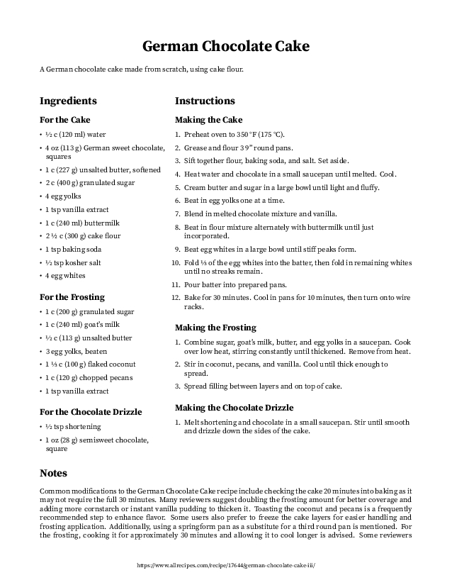
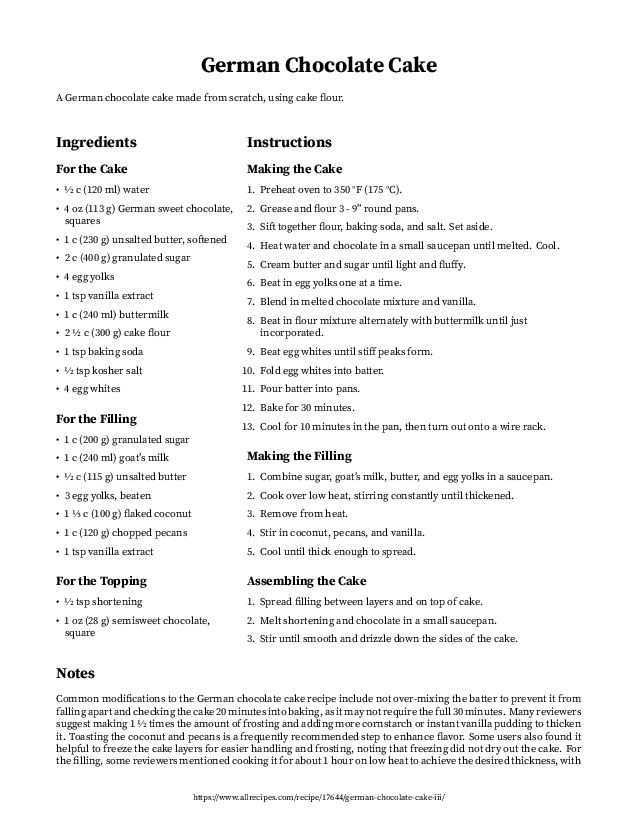

# Examples

## PDF Output

```
OPENAI_API_KEY='your-api-key'
URL='https://www.allrecipes.com/recipe/7399/tres-leches-milk-cake/'
```

|  |
|:-------------------------------------:|
|       `rf -o example1.pdf $URL`       |

|  |
|:-------------------------------------:|
|     `rf -o example2.pdf -n $URL`      |

|  |
|:-------------------------------------:|
|    `rf -o example3.pdf -n -g $URL`    |

|   |
|:---------------------------------------------------------------------------:|
|                    `rf -t -o example4.pdf -n -g -t $URL`                    |

|   |
|:---------------------------------------------------------------------------:|
|           `rf -o example5.pdf -n -g -t -r "sub goat's milk" $URL`           |

|   |
|:---------------------------------------------------------------------------:|
|        `rf -o example6.pdf -n -g -t -r "sub goat's milk" -s 2 $URL`         |