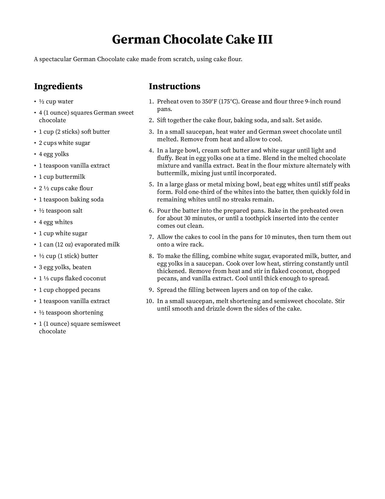

# Examples

## PDF Output

```
URL='https://www.allrecipes.com/recipe/17644/german-chocolate-cake-iii/'
```

|  |
|:----------------------------:|
|  `rf -o example1.pdf $URL`   |

|  |
|:----------------------------:|
| `rf -o example2.pdf -n $URL` |

|     |
|:-------------------------------:|
| `rf -o example3.pdf -n -g $URL` |

|                          |
|:----------------------------------------------------:|
| `rf -o example4.pdf -n -g -r "sub goat's milk" $URL` |
